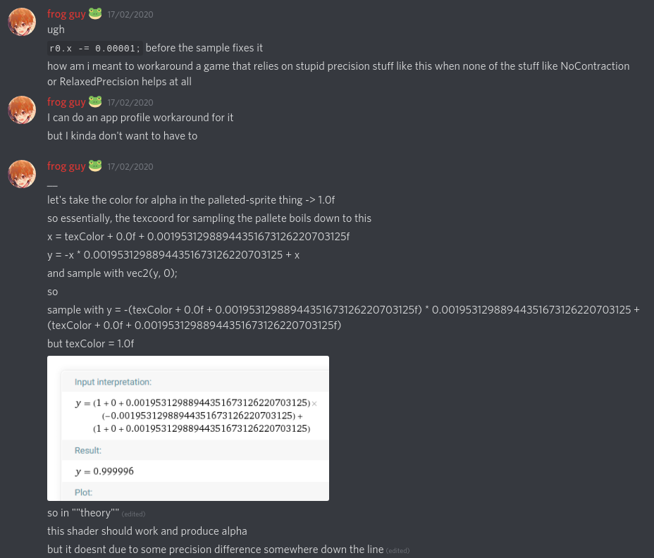

# The Issue

Launching the game with DXVK or wined3d always results in certain cutscene sprites to be rendered with black boxes around.


### Further descriptions:
- https://github.com/doitsujin/dxvk/issues/1433
- https://github.com/ValveSoftware/Proton/issues/2166

### Software information
Game: [htoL#NiQ: The Firefly Diary / htoL#NiQ-ホタルノニッキ](https://store.steampowered.com/app/368640/htoLNiQ_The_Firefly_Diary__htoLNiQ/)

### System information
- GPU: AMD Fury X
- Driver: Mesa 19.3.3 + LLVM 9.0.0
- Wine version: Proton 5.0.1 / 5.0
- DXVK version: Proton 5.0.1 / 1.5.4

# The fix
Thanks to DXVK/D9VK developer [Joshua-Ashton](https://github.com/Joshua-Ashton),
the problem was narrowed down to a precision problem with Mesa's AMD driver and a suggestion was provided on how to workaround it. (The issue is absent on NVIDIA).  
With Mesa's ability to perform Shader Replacements described in Ref. 1,
we create directories `mesa/dump` and `mesa/read` in the game directory then launch
the game with modified Launch Options:
```
PROTON_USE_WINED3D=1  MESA_SHADER_DUMP_PATH='mesa/dump' %command%
```
Afterwards, we click on a Memory Fragment and greeted with the abnormal sprites.  
At this point we close the game and listing the `mesa/dump`,
we're greeted with a numerous list of shaders from the game.
```
$ tree tmp
tmp
└── dump
    ├── FS_698b1ee6c51f3149eee4532b48177b2f4859f4b0.glsl
    ├── FS_7d1f3590eec174f56a3ac42e062ed0bf6c53fe00.glsl
    ├── FS_8652a5f0ee1a70c160cf6133d1d0edc3b8897309.glsl
    ├── FS_8770dd16caadadca279446d55fd30441e195c278.glsl
    ├── FS_89857dbc081df569b4e865b6f66097c856e7e9f2.glsl
    ├── FS_b638fd0ca1141b9d2a6af59754cd9ab3f03debbc.glsl
    ├── FS_d6dd8083a7f10c493ba2b677d537b735a14e9d85.glsl
    ├── VS_0cc93984453945ed0f042745bc287e19a1fbe783.glsl
    ├── VS_1bb1706b819b2c5836e839a5c41802de6ab43c46.glsl
    ├── VS_2896a0bd75b1b6fd9c4b9c3a2b1f9e44ded9b819.glsl
    ├── VS_5e6d330066661b5a165cfcf62f118f09799215f5.glsl
    ├── VS_b2974ada576a3edf32e678513768bff3fc8e9b2b.glsl
    ├── VS_b3a6050d664a9c7a004ec73778e5a4abf024082b.glsl
    ├── VS_df20480397a22585eeeb5db3f77bb5fe7b18cfb3.glsl
    └── VS_fb61114006e7b75cd29e068197bd3eacea4a1e16.glsl

1 directory, 15 files
```

Sifting through each file, we arrive at shader `FS_b638fd0ca1141b9d2a6af59754cd9ab3f03debbc.glsl`
whose content bears some similarity to what was discussed with DXVK developer:
```
#version 440
#extension GL_ARB_cull_distance : enable
#extension GL_ARB_gpu_shader5 : enable
#extension GL_ARB_shader_atomic_counters : enable
#extension GL_ARB_shader_bit_encoding : enable
#extension GL_ARB_shader_image_load_store : enable
#extension GL_ARB_shader_image_size : enable
#extension GL_ARB_shader_storage_buffer_object : enable
#extension GL_ARB_shader_texture_image_samples : enable
#extension GL_ARB_shading_language_420pack : enable
#extension GL_ARB_shading_language_packing : enable
#extension GL_ARB_texture_cube_map_array : enable
#extension GL_ARB_texture_gather : enable
#extension GL_ARB_texture_query_levels : enable
#extension GL_ARB_uniform_buffer_object : enable
#extension GL_ARB_viewport_array : enable
#extension GL_EXT_texture_array : enable
#extension GL_ARB_conservative_depth : enable
#extension GL_ARB_derivative_control : enable
#extension GL_ARB_explicit_attrib_location : enable
#extension GL_ARB_fragment_coord_conventions : enable
#extension GL_ARB_fragment_layer_viewport : enable
#extension GL_ARB_sample_shading : enable
#extension GL_ARB_shader_texture_lod : enable
uniform vec4 ps_c[32];
layout(binding = 0)
uniform sampler2D ps_sampler0;
layout(binding = 1)
uniform sampler2D ps_sampler1;
vec4 R0;
vec4 tmp0;
vec4 tmp1;
const vec4 ps_lc1 = intBitsToFloat(ivec4(0x3b000015 /* 1.95312989e-03 */, 0 /* 0.00000000e+00 */, 0 /* 0.00000000e+00 */, 0 /* 0.00000000e+00 */));
const float FLT_MAX = 1e38;
uniform struct
{
    vec4 color;
    float density;
    float end;
    float scale;
} ffp_fog;
in vec4 ffp_varying_diffuse;
in vec4 ffp_varying_texcoord[8];
vec4 ffp_texcoord[8];
in float ffp_varying_fogcoord;
vec4 ps_out[8];
layout(location = 0) out vec4 color_out0;
void main()
{
ffp_texcoord[0] = ffp_varying_texcoord[0];
vec4 T0 = ffp_texcoord[0];
R0.xyzw = (texture(ps_sampler0, T0.xy).xyzw);
R0.x = (R0.w + ps_c[0].z);
R0.x = (R0.x + ps_lc1.x);
R0.x = ((-R0.x * ps_lc1.x) + R0.x);
R0.y = (ps_lc1.y);
R0.x = (R0.x - 0.00001); // MODIFIED HERE
R0.xyzw = (texture(ps_sampler1, R0.xy).xyzw);
R0.xyzw = (R0.xyzw * ffp_varying_diffuse.xyzw);
ps_out[0].xyzw = (R0.xyzw);
color_out0 = ps_out[0];
}
```
To avoid duplication, the block above already incorporates the workaround hinted by [Joshua-Ashton](https://github.com/Joshua-Ashton).
The only difference between this and the original is the `// MODIFIED HERE` line.
Now, we save/copy this file into `mesa/read/FS_b638fd0ca1141b9d2a6af59754cd9ab3f03debbc.glsl`
and set the game Launch Options to:
```
PROTON_USE_WINED3D=1  MESA_SHADER_READ_PATH='mesa/read' %command%
```


# Chat Exchange




# References
1. <https://eleni.mutantstargoat.com/hikiko/2017/08/03/mesa-replacement-shaders/>
2. <https://github.com/ValveSoftware/Proton>

----

# Update 25/02/2020
Thanks to CME and [Joshua-Ashton](https://gitlab.freedesktop.org/JoshuaAshton), the issue was narrowed down to
radv code in Mesa for the DXVK case (https://gitlab.freedesktop.org/mesa/mesa/-/merge_requests/3951) and radeonsi for the WineD3D case (https://gitlab.freedesktop.org/mesa/mesa/-/merge_requests/3953).
CME's paste url/patch:
```
diff --git a/src/amd/vulkan/radv_device.c b/src/amd/vulkan/radv_device.c
index e38fd9bc62b..fbaad8730a0 100644
--- a/src/amd/vulkan/radv_device.c
+++ b/src/amd/vulkan/radv_device.c
@@ -6921,7 +6921,7 @@ radv_init_sampler(struct radv_device *device,
                             S_008F30_ANISO_BIAS(max_aniso_ratio) |
                             S_008F30_DISABLE_CUBE_WRAP(0) |
                             S_008F30_COMPAT_MODE(compat_mode) |
-                            S_008F30_FILTER_MODE(filter_mode));
+                            S_008F30_FILTER_MODE(filter_mode) | S_008F30_TRUNC_COORD(1));
        sampler->state[1] = (S_008F34_MIN_LOD(S_FIXED(CLAMP(pCreateInfo->minLod, 0, 15), 8)) |
                             S_008F34_MAX_LOD(S_FIXED(CLAMP(pCreateInfo->maxLod, 0, 15), 8)) |
                             S_008F34_PERF_MIP(max_aniso_ratio ? max_aniso_ratio + 6 : 0));
```
## Exchange


